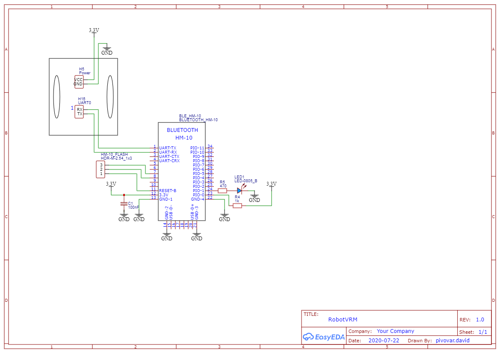
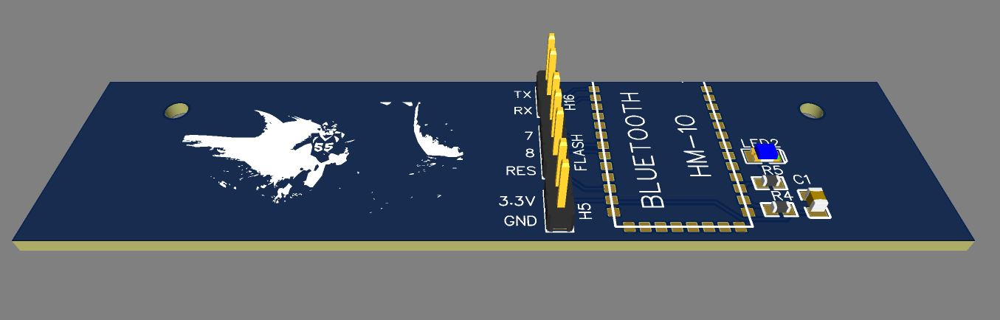

# RobotVRM

Control Robot vehicle (RobotTMR - ZCU) with mobile app or voice recognition module.
Communication with robot is via HM-10 BLE module (HMSoft firmware required - [how to flash the firmware](https://circuitdigest.com/node/3688)) or 433MHz module.

* MSP430 - additional msp430 libraries
* Robot TMR - original robot folowing line
* RobotVRM - new robot firmware
* RobotVoiceControlMobileApp - mobile app
* VR_SerialPortCom - Win app to train and test VRM module

### RobotVRM
Firmware for supervisor MSP430 MCU. Updated original firmware with communication on UART0.

#### Pins to connect HM-10 and 433Mhz module:
* VCC/GND - H5 (VCC next to 22uF capacitor)
* TX/RX - H16 (UART0_RX at "1")

### RobotVoiceControlMobileApp
Mobile app for Android and iOS with speech recognition (iOS speech recognition is not tested). Build with Xamarin.Forms. Communication is via BLE\
Speech recognition requires an Azure Cognitive Services resource ([Create a Cognitive Services resource](https://docs.microsoft.com/cs-cz/azure/cognitive-services/cognitive-services-apis-create-account?tabs=multiservice%2Cwindows)). Set API key and region in the settings of the app or in [Constants.cs](RobotVoiceControlMobileApp/RobotVoiceControlMobileApp/Constants.cs).

### Voice recognition module
TBD

#### Schematic

#### PCB
